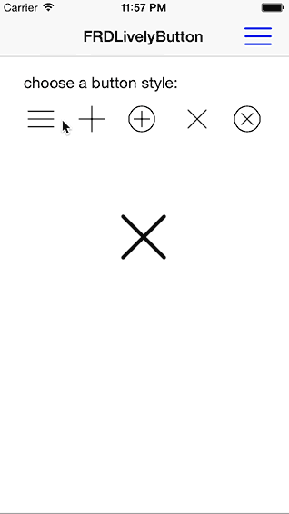

# FRDLivelyButton

`FRDLivelyButton` is a simple UIButton subclass intended to be used inside a UIBarButtonItem,
even though it can be used anywhere you can use a UIButton. 
It is entirely Core Graphics driven, supports 5 common button types (menu, close, add, etc...)
used in navigation bar, and will nicely animate any button type changes and touch events.



## Requirements

`FRDLivelyButton` uses ARC and requires iOS 6.1+.


## Installation

### CocoaPods

`pod 'FRDLivelyButton', '~> 1.1.3'`

### Manual

Copy the folder `FRDLivelyButton` to your project.

## Usage

Add a FRDLivelyButton either in code or using interface builder.

Example, how to add a ```FRDLivelyButton``` in a nav bar:

``` objc
FRDLivelyButton *button = [[FRDLivelyButton alloc] initWithFrame:CGRectMake(0,0,36,28)];
[button setStyle:kFRDLivelyButtonStyleHamburger animated:NO];
[button addTarget:self action:@selector(buttonAction:) forControlEvents:UIControlEventTouchUpInside];
UIBarButtonItem *buttonItem = [[UIBarButtonItem alloc] initWithCustomView:button];
self.navigationItem.rightBarButtonItem = buttonItem;
```

To change the button style, just call ```setStyle:animated```:

``` objc
[self.myButton setStyle:kFRDLivelyButtonStyleCircleClose animated:YES];
```

The current type of the button can be accessed using the buttonStyle property:

``` objc
- (IBAction)buttonAction:(FRDLivelyButton *)sender
{
    if (sender.buttonStyle == kFRDLivelyButtonStylePlus) {
    	// logic
    } else ....
}
```


## Customizing Appearance

Button appearance and behavior can be customized using an options NSDictionary. Color, highlighted color, line thickness, animation 
durations, etc... can be customized. Default should work just fine though.

See FRDLivelyButton.h for list of possible attributes.

Example:

``` objc
[button setOptions:@{ kFRDLivelyButtonLineWidth: @(2.0f),
                      kFRDLivelyButtonHighlightedColor: [UIColor colorWithRed:0.5 green:0.8 blue:1.0 alpha:1.0],
                      kFRDLivelyButtonColor: [UIColor blueColor]
                      }];
```


## License

    The MIT License (MIT)

    Copyright (c) 2014 Sebastien Windal

    Permission is hereby granted, free of charge, to any person obtaining a copy
    of this software and associated documentation files (the "Software"), to deal
    in the Software without restriction, including without limitation the rights
    to use, copy, modify, merge, publish, distribute, sublicense, and/or sell
    copies of the Software, and to permit persons to whom the Software is
    furnished to do so, subject to the following conditions:

    The above copyright notice and this permission notice shall be included in
    all copies or substantial portions of the Software.

    THE SOFTWARE IS PROVIDED "AS IS", WITHOUT WARRANTY OF ANY KIND, EXPRESS OR
    IMPLIED, INCLUDING BUT NOT LIMITED TO THE WARRANTIES OF MERCHANTABILITY,
    FITNESS FOR A PARTICULAR PURPOSE AND NONINFRINGEMENT. IN NO EVENT SHALL THE
    AUTHORS OR COPYRIGHT HOLDERS BE LIABLE FOR ANY CLAIM, DAMAGES OR OTHER
    LIABILITY, WHETHER IN AN ACTION OF CONTRACT, TORT OR OTHERWISE, ARISING FROM,
    OUT OF OR IN CONNECTION WITH THE SOFTWARE OR THE USE OR OTHER DEALINGS IN
    THE SOFTWARE.


